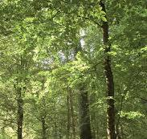

    

  
  

 
      

## About me

This is really just a filler to get the hang of how github works. I'll probably comback later and change this out, or maybe I won't... who really knows.

 Drop down example 

| Names | Links |
|-----:|---------------|
|     1| *insert link* |
|     2| *insert link* |
|     3| *insert link* |

<!-- This is how to use different images based on the light vs dark mode

<picture>
 <source media="(prefers-color-scheme: dark)" srcset="https://s3-eu-west-1.amazonaws.com/blog-ecotree/blog/0001/01/ad46dbb447cd0e9a6aeecd64cc2bd332b0cbcb79.jpeg">
 <source media="(prefers-color-scheme: light)" srcset="Image/Light_Trees.jpg">
 
</picture>
-->
